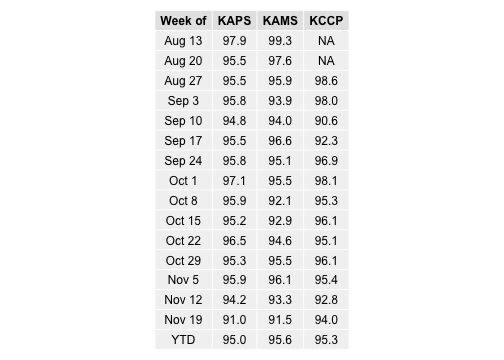
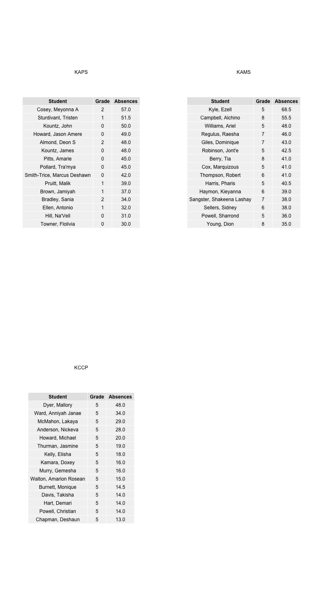
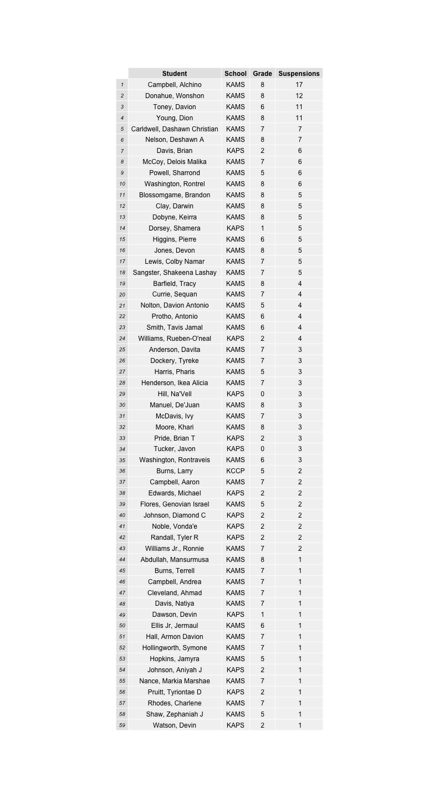

KIPP Chicago Regional Attendance Report
========================================================
Week of April 15, 2013
--------------------------------------------------------

### Attendance

#### Daily Enrollment and Attendance by School (last 20 weeks)
The greeen line demarcates 95% of enrollment (i.e., our regional daily attendance goal).
 

#### Weekly & YTD Attendance by School
 

#### Student Attendance 
 

### Suspensions

#### Total YTD Suspensions by School & by Week
 

#### YTD Students Suspended (ordered by number of suspensions)
 

#### Students Suspended, Previous 4 Weeks (ordered by number of suspensions)
 

